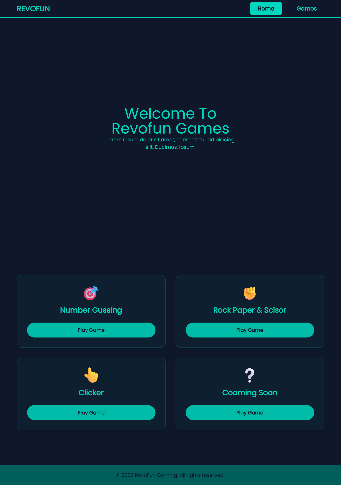
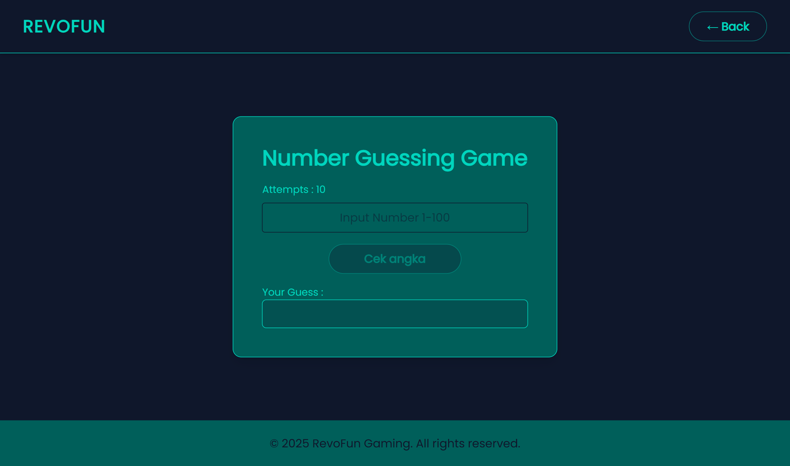
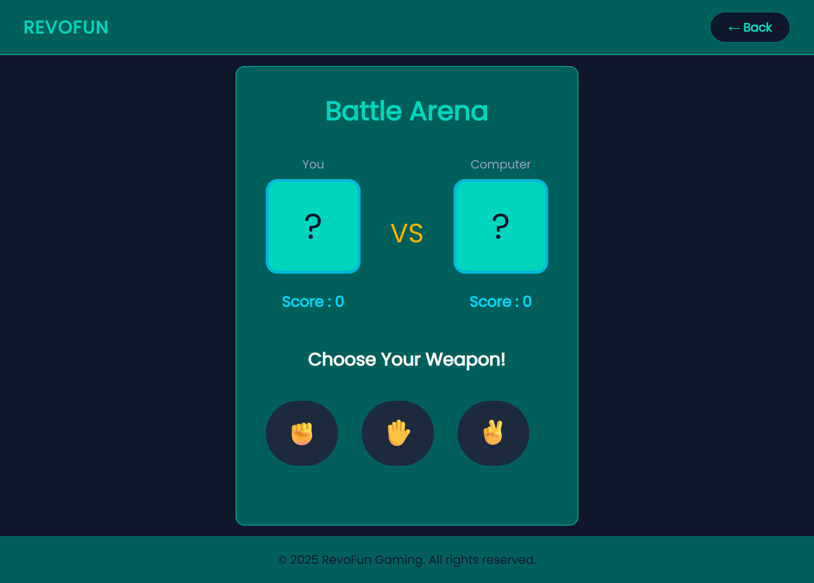
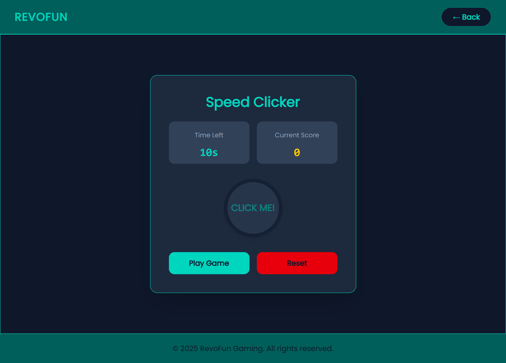

# Revofun Games 🎮

Revofun Games adalah sebuah portal game web interaktif yang menyuguhkan berbagai permainan ringan untuk mengisi waktu luang. Proyek ini berfokus pada pengalaman pengguna yang bersih dengan antarmuka bertema *Dark Mode* yang modern.

---

## 🌟 Features Implemented

* **Unified Gaming Dashboard**: Halaman utama yang responsif untuk memilih berbagai kategori permainan.
* **Number Guessing Game**: Permainan tebak angka (1-100) dengan indikator sisa percobaan (*attempts*).
* **Rock Paper Scissors**: Battle Arena melawan komputer dengan sistem skor real-time dan antarmuka visual berbasis emoji.
* **Speed Clicker**: Game uji kecepatan klik dengan sistem timer (count down) 10 detik.
* **Global Navigation**: Navbar konsisten di setiap halaman dengan tombol "Back" untuk memudahkan navigasi antar game.
* **Responsive UI**: Desain yang dioptimalkan untuk kenyamanan visual menggunakan Tailwind CSS.

---

---

## 🛠️ Technologies Used

* **HTML5**: Sebagai kerangka utama struktur web.
* **Tailwind CSS (v4)**: Digunakan untuk styling cepat, desain responsif, dan manajemen tema warna (Primary, Secondary, Dark).
* **JavaScript (Vanilla)**: Menggerakkan seluruh logika permainan, mulai dari pengacakan angka, logika kemenangan RPS, hingga fungsi timer pada Clicker.
* **Git & GitHub**: Digunakan untuk version control dan manajemen progress project.

---

## 📸 Screenshots

### 🏠 Landing Page

### 🔢 Number Guessing

### ⚔️ Battle Arena (RPS)

### ⏱️ Speed Clicker

---

## 🚀 How to Play

1. Akses halaman utama `index.html`.
2. Pilih game yang ingin dimainkan melalui kartu game yang tersedia.
3. Gunakan tombol **Back** di pojok kanan atas untuk kembali ke menu utama kapan saja.

---

## 📝 Project Identity
* **Developer**: Fakhridho Gunawan
* **Year**: 2025
* **Platform**: RevoFun Gaming Portal